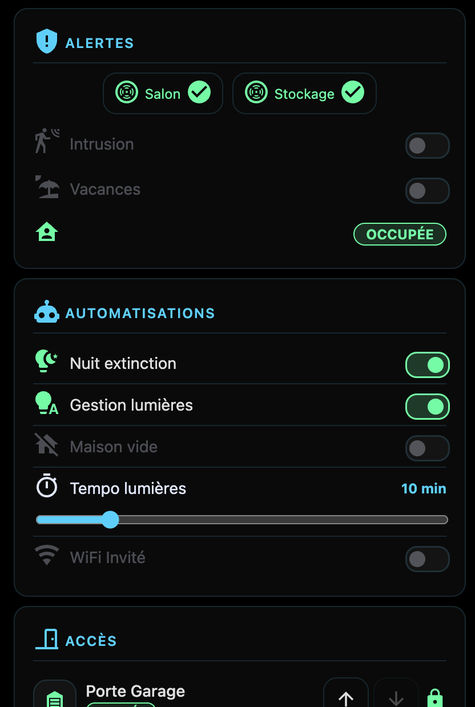
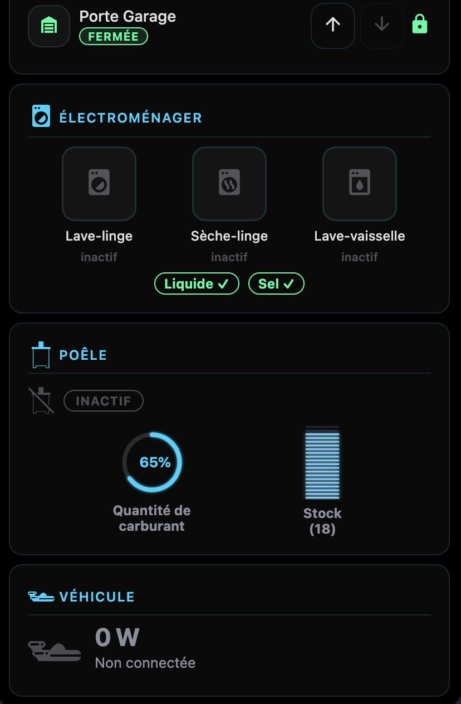

# 🏠 Bridge Overview (`sci-fi-bridge`)

Carte dashboard maison. Affiche le statut global de la maison en temps réel — présence de l'équipage, alertes critiques, points d'accès, automatisations, électroménager, poêle, voiture et panneau d'actions rapides.

> Spec complète : [docs/specs/cards/bridge.md](../specs/cards/bridge.md)

## Aperçus






---

## Installation

Ajouter la ressource `sci-fi.min.js` à votre dashboard HA, puis :

```yaml
type: custom:sci-fi-bridge
```

---

## Configuration

### Exemple minimal

```yaml
type: custom:sci-fi-bridge
persons:
  - entity: person.adrien
actions:
  items:
    - entity: input_button.call_kids
      name: "Appeler enfants"
      icon: "mdi:bullhorn"
```

### Exemple complet

```yaml
type: custom:sci-fi-bridge

persons:
  - entity: person.adrien
  - entity: person.virginie

alerts:
  icon: mdi:shield-alert          # optionnel
  smoke:
    - entity: binary_sensor.smoke_salon
      name: Salon
      icon: mdi:smoke-detector    # optionnel
  toggles:
    - entity: automation.alerte_intrusion
      name: Intrusion
      icon: mdi:motion-sensor
  occupancy: binary_sensor.people_at_home

access:
  icon: mdi:door-closed           # optionnel
  items:
    - entity: cover.portail
      name: Portail
      icon: mdi:gate
    - entity: lock.porte_entree
      name: Entrée

automations:
  icon: mdi:robot                 # optionnel
  items:
    - entity: automation.volets_auto
      name: Volets
  slider:
    entity: input_number.delay
    min: 0
    max: 60
    step: 5

appliances:
  icon: mdi:washing-machine       # optionnel
  cycles:
    - entity: binary_sensor.lave_linge
      name: Lave-linge
      icon: mdi:washing-machine
      running_states: [on]
  consumables:
    - entity: binary_sensor.sel_bac
      name: Sel bac
      ok_when: "off"

stove:
  icon: mdi:fire                  # optionnel
  pellet_quantity: sensor.pellets_qty
  pellet_stock: sensor.pellets_stock
  status: sensor.stove_status
  low_threshold: 0.3

vehicle:
  icon: mdi:ev-station            # optionnel
  power_sensor: sensor.ev_power


actions:
  icon: mdi:lightning-bolt        # optionnel
  items:
    - entity: script.run_cleanup
      name: Nettoyage
      icon: mdi:broom
      color: "#ff9800"            # optionnel (couleur active)
    - entity: automation.trigger_alarm
      name: Alarme
      icon: mdi:alarm-light
```

---

## Sections disponibles

Toutes les sections sont **optionnelles** — absente du YAML = non affichée (zéro erreur).

| Section | Clé YAML | Description |
|---------|-----------|-------------|
| Crew | `persons` | Présence de l'équipage avec zones HA (home / away / work…) |
| Alertes | `alerts` | Détecteurs fumée, toggles automation, capteur occupancy |
| Accès | `access` | Portes, portails, verrous — contrôles ouvrir/fermer |
| Automatisations | `automations` | Toggles automation + slider temporisation |
| Électroménager | `appliances` | Cycles en cours (lave-linge…) + consommables (sel, rinçage…) |
| Poêle | `stove` | Quantité pellets (barre progression), stock, état poêle |
| Voiture | `vehicle` | Puissance de charge EV (lecture seule) |
| Actions | `actions` | Panel de boutons d'actions rapides (scripts, automatisations, boutons, etc.) |

---

## Icônes

Chaque section et chaque entrée accepte un champ `icon` optionnel (chaîne MDI, ex: `mdi:garage`).  
Si absent, l'icône par défaut de la section est utilisée.  
L'éditeur visuel propose un **icon picker searchable** (MDI + icônes sci-fi custom).

---

## Design responsive

- **Portrait / mobile** : 1 colonne
- **Paysage / tablette / desktop** : 2 colonnes
- Layout via **CSS container queries** (`@container`) — indépendant de la largeur viewport

---

## Éditeur visuel

La carte dispose d'un éditeur GUI complet dans l'interface HA :
- Accordéons par section — activer/désactiver une section
- Listes extensibles (ajouter/supprimer smoke, toggles, items, cycles, consumables)
- Icon picker searchable pour tous les champs icône
- Sélecteur d'entité pour tous les champs entité

---

## Voir aussi

- [Spec technique](../specs/cards/bridge.md)
- [Blueprint stratégique](../strategic/bridge_overview_blueprint.md)
- [Changelog](../../CHANGELOG.md)
