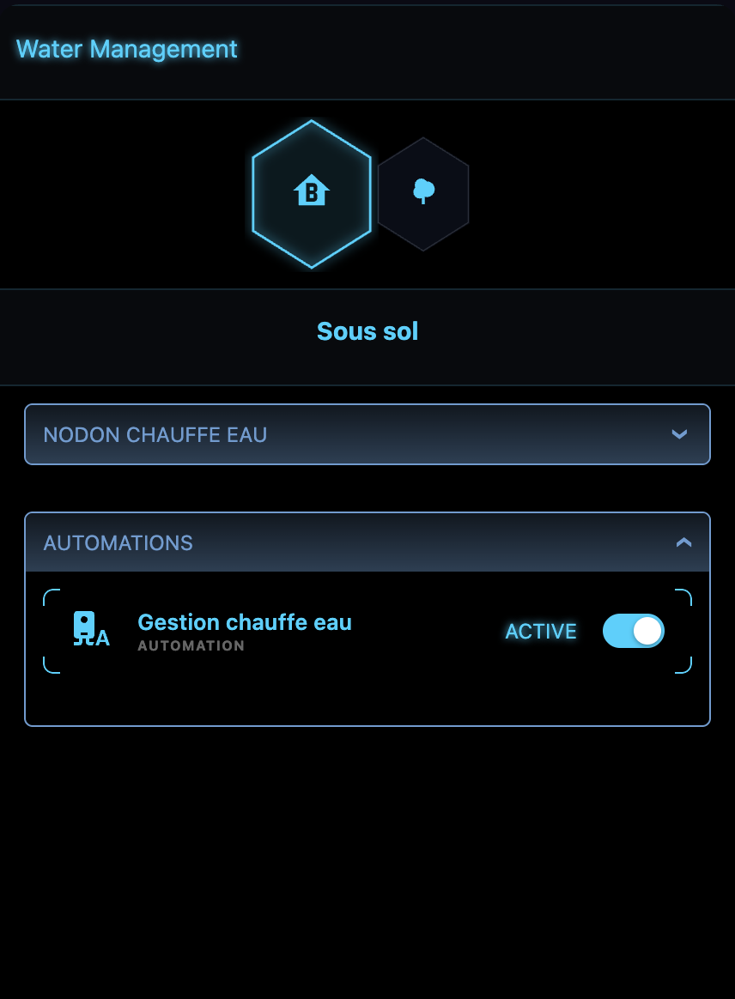
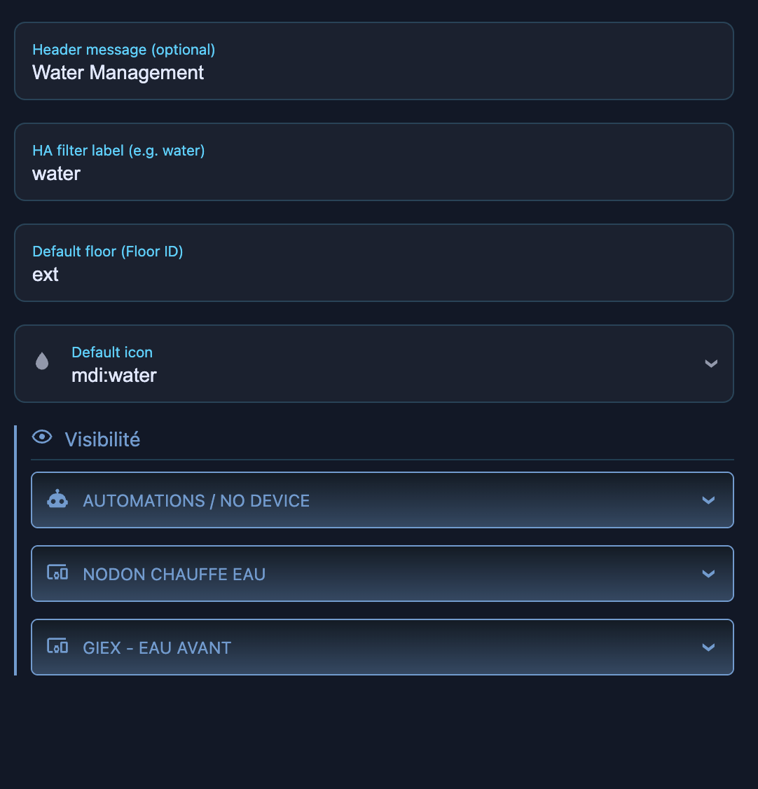
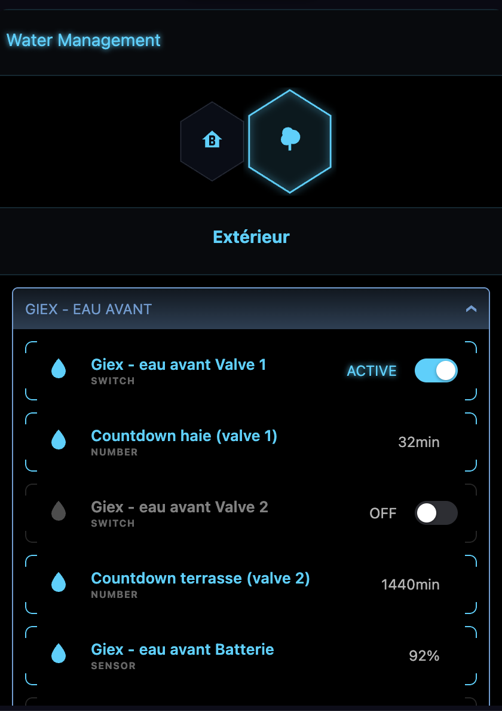
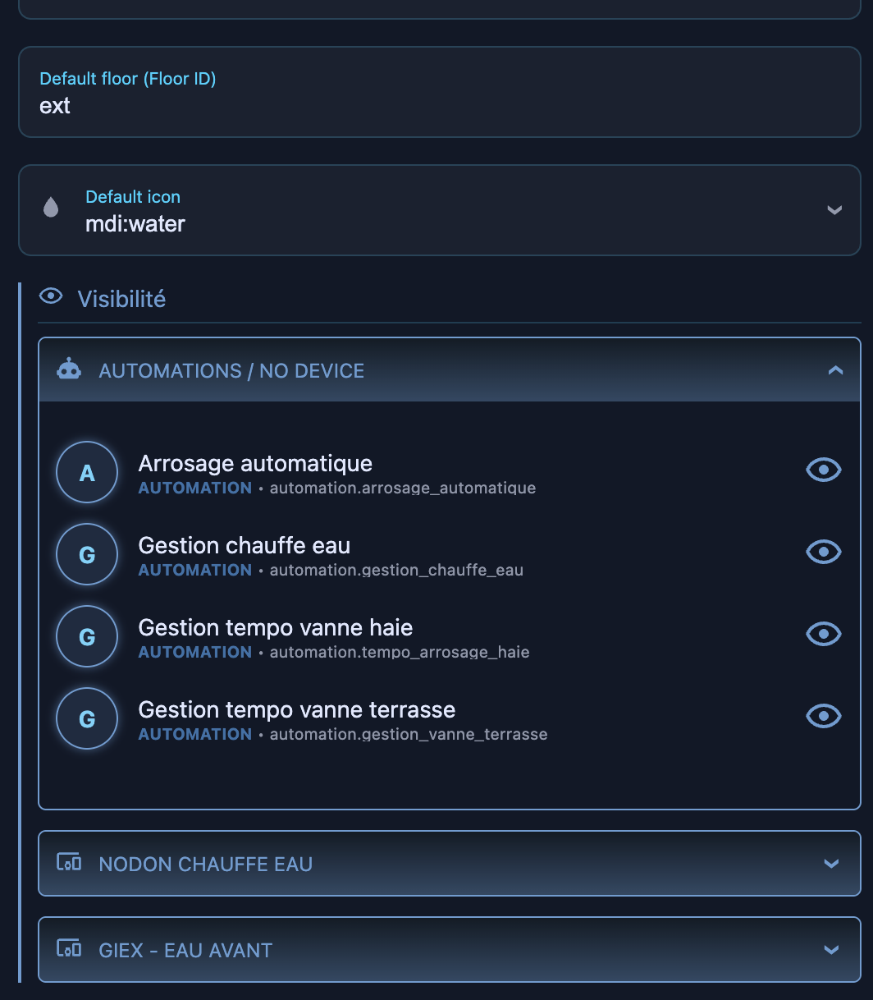

# 💧 Water Management Card

The Water Management card provides a centralized interface for monitoring and controlling water-related entities such as water heaters, smart valves, and leak sensors. Devices are automatically grouped by floor and area.

## Screenshots

| Card View | Configuration UI |
|---|---|
|  |  |
|  |  |

## Features
- **Auto-Discovery**: Automatically discovers entities by floor/area or specified HA label.
- **Water Heaters & Valves**: Unified ON/OFF controls for all water equipment.
- **Visibility Toggles**: Easily hide or show individual sensors inside the configuration UI.
- **Sensor Grouping**: Sensors are grouped logically under their parent device (e.g., Nodon Water Heater, Giex Valve).

## YAML Configuration

```yaml
type: custom:sci-fi-water-management
header: Water Management
label: water
default_floor: rdc
```

### Options

| Name | Type | Default | Description |
|------|------|---------|-------------|
| `type` | `string` | **required** | `custom:sci-fi-water-management` |
| `header` | `string` | *optional* | Custom title for the card. |
| `label` | `string` | *optional* | HA filter label used to group and auto-discover entities. |
| `default_floor` | `string` | *optional* | The ID of the floor to open by default. |
| `default_icon` | `string` | `mdi:floor-plan` | The fallback icon for floors. |
| `visibility` | `object` | `{}` | A dictionary of entity IDs mapped to boolean indicating whether they should be shown. Designed to be configured via the UI. |
